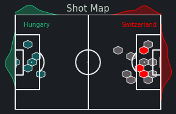

# Euros2024-Reports

## Automated Web Scraping Pipeline for Match Report Generation

Automated Web Scrapping pipeline that receives a user URL as input and extracts advanced events data in JSON format for the specific game from whoscored.com. 

It then processes and generates a PDF performance report to assess and contrast pass network dynamics, pass, shots & actions analysis, match momentum, etc.

After several transformations and data manipulation, the report is successfully displaying the following information in vizzes by leveraging mlpsoccer library in Python:

* Pass Networks
* Pass Flow Map
* Defensive Actions
* Expected Threat Map
* Actions HeatMap
* Shot Map
* Match Momentum by xT
* Dominant Team by Grid

To-Dos. Still need to expand the flag, names, and score of the games so it populates automatically.
